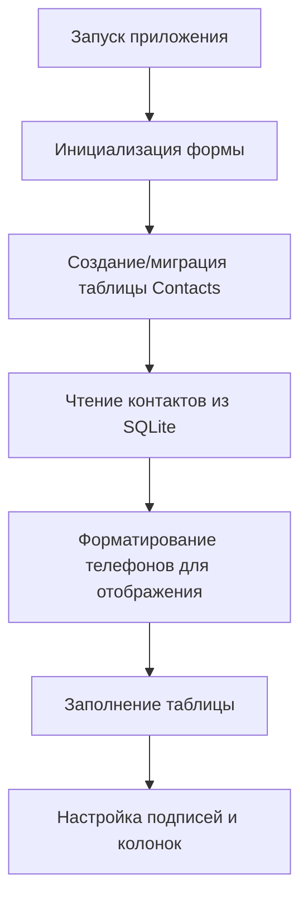
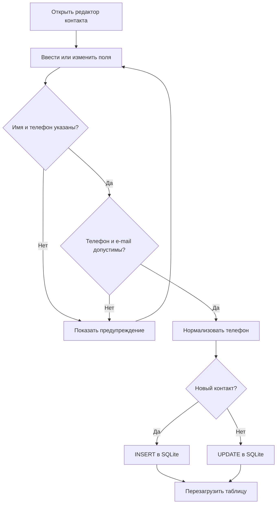
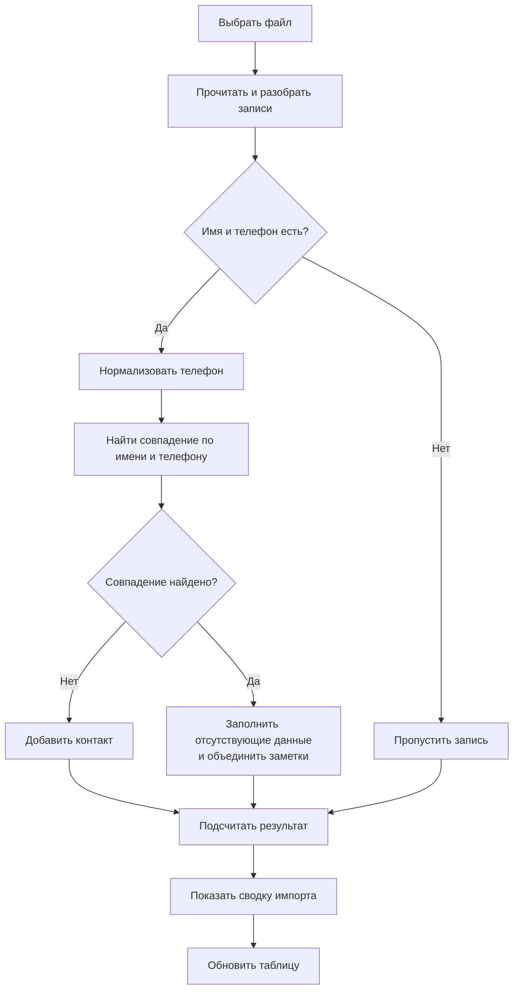

# Алгоритмы и пользовательские потоки

## Запуск и загрузка контактов

В хранилище телефон нормализуется до цифр. Форматирование для отображения не
меняет сохранённое значение.

## Добавление и редактирование

## Импорт CSV/VCF

Совпадение определяется после схлопывания пробелов в имени и нормализации
телефона; регистр имени игнорируется. При совпадении существующий e-mail,
группа и день рождения сохраняются, если уже заполнены. Новые заметки
добавляются без точного повтора.

## Удаление

1. Пользователь отмечает контакты флажками.
2. Приложение запрашивает подтверждение.
3. При подтверждении контакты удаляются по `Id`.
4. Таблица загружается повторно.

## Поиск и сортировка

Поиск передаётся параметризованному SQL-запросу с шаблоном `LIKE` по имени,
телефону, e-mail, заметкам, дате рождения и группе. Нажатие заголовка
сортируемого столбца переключает направление сортировки.

## Печать

Печать строится из контактов, отмеченных флажками: открывается предварительный
просмотр, а обработчик страницы выводит основные поля и переходит на следующую
страницу при переполнении.
