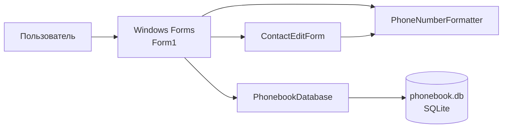
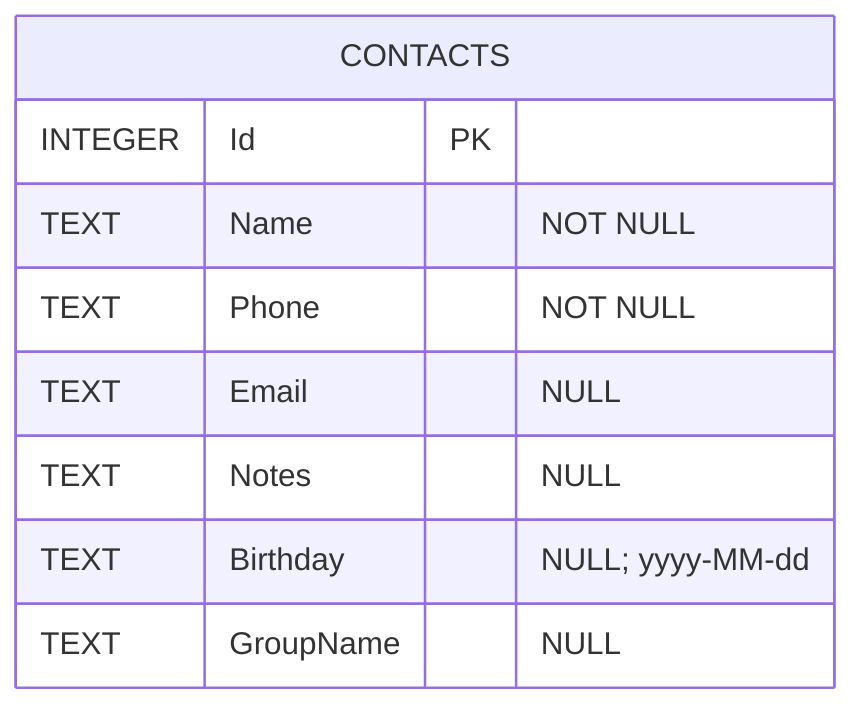

# Архитектура и схема данных

## Слои приложения



Главная форма связывает элементы интерфейса с операциями над контактами.
`ContactEditForm` проверяет пользовательский ввод, `PhoneNumberFormatter`
разделяет хранение цифрового представления телефона и его отображение,
`PhonebookDatabase` выполняет SQL-операции через параметризованные команды.

## Компоненты

### `Program`

Включает стандартную конфигурацию Windows Forms и запускает `Form1` в
однопоточном apartment (STA).

### `Form1`

Загружает данные в таблицу, применяет подписи и форматирование столбцов,
обрабатывает поиск и выбор контактов. Импорт CSV/VCF преобразует входные строки
в `Contact`, затем передаёт запись в базовый слой. Экспорт выполняется только
для контактов, отмеченных флажками.

### `ContactEditForm`

Создаёт или редактирует контакт. Имя и телефон обязательны; телефон хранится
только цифрами, а перед сохранением проверяется допустимая длина. E-mail
проверяется регулярным выражением. Группа может быть выбрана из существующих
или введена вручную.

### `PhonebookDatabase`

Создаёт схему, читает список/группы, добавляет, обновляет, удаляет и объединяет
контакты. SQL-параметры используются для пользовательских значений.

## Схема SQLite



`Contacts` — единственная прикладная таблица. Первичный ключ `Id` назначается
SQLite автоматически. Дата рождения хранится строкой ISO `yyyy-MM-dd`;
пустые необязательные значения записываются как SQL `NULL`.

База создаётся в каталоге приложения:

```text
Path.Combine(AppDomain.CurrentDomain.BaseDirectory, "phonebook.db")
```

Файл содержит персональные данные и не должен включаться в Git.
